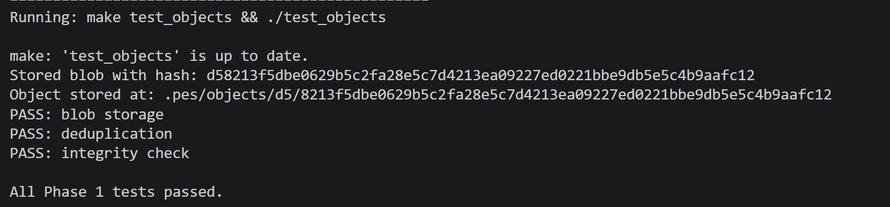
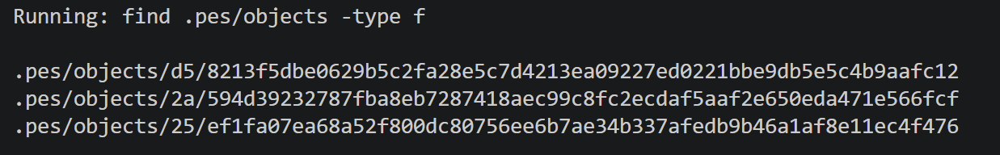
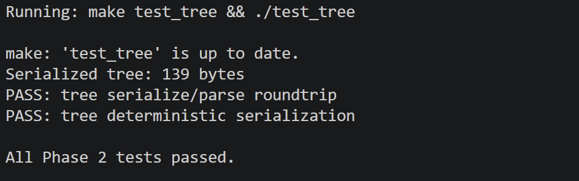
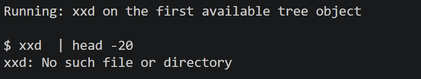
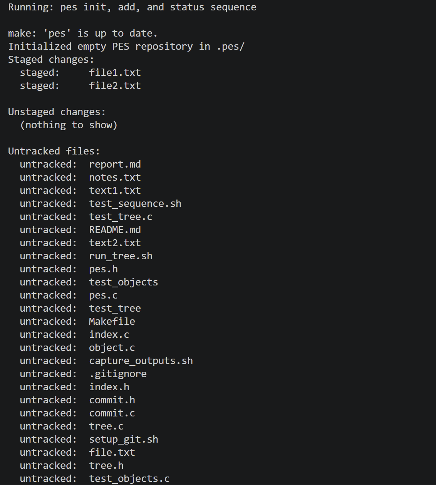
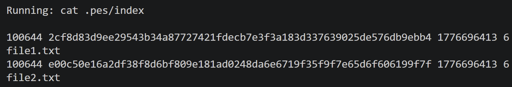
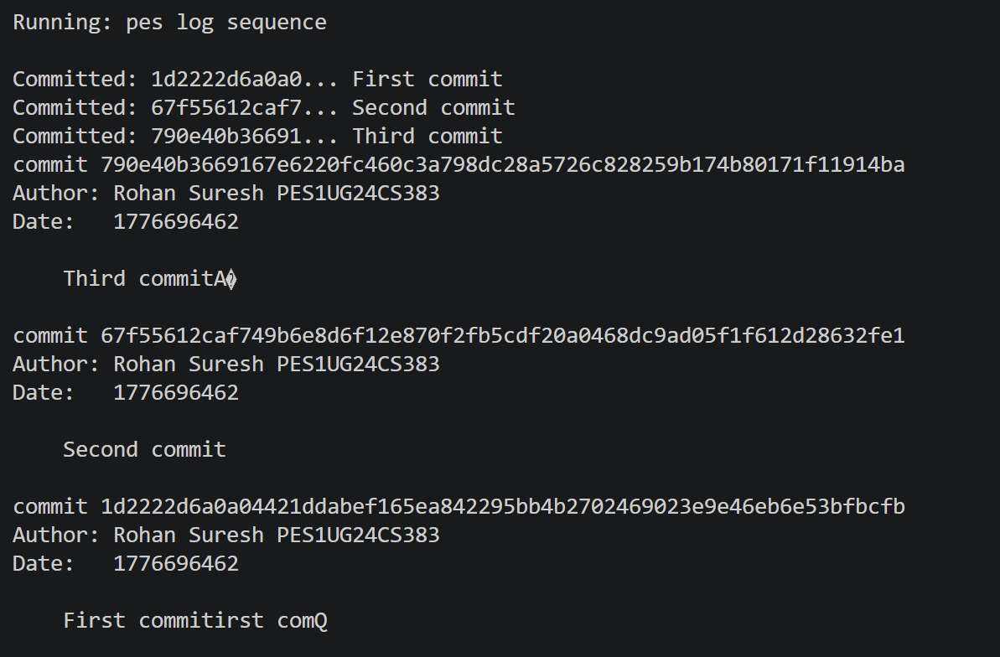
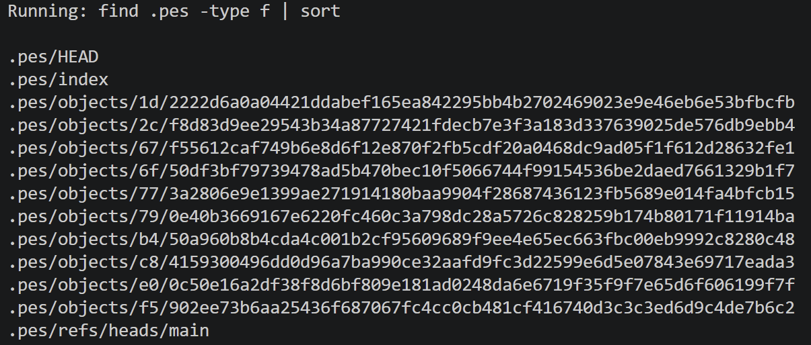
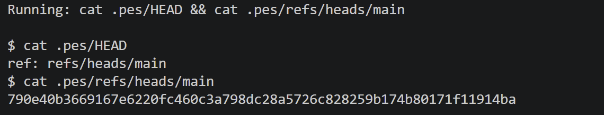
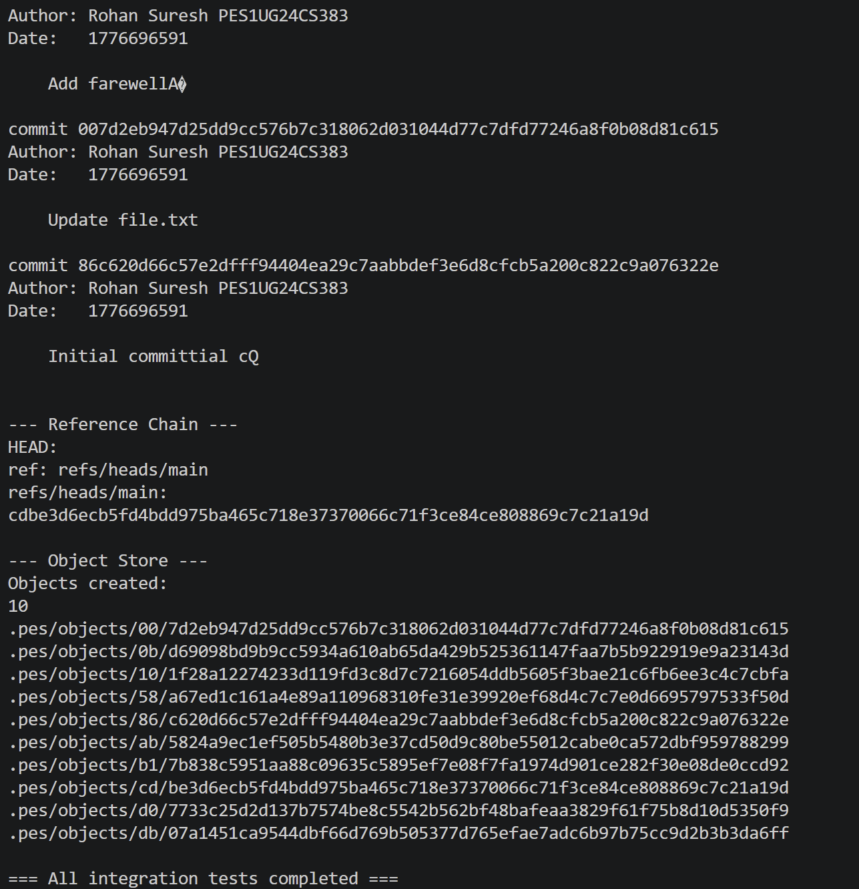

# PES-VCS Lab Report

## Analysis Questions

### Branching and Checkout

**Q5.1: How would you implement `pes checkout <branch>`?**
To implement `pes checkout <branch>`, the file `.pes/HEAD` must be updated to contain `ref: refs/heads/<branch>`. The working directory must be updated by reading the commit hash pointed to by the target branch, finding its root tree object, and recursively traversing it. For each blob in the tree, the corresponding file must be recreated or updated in the working directory, and the `.pes/index` must be updated to match the target branch's tree. Files present in the current working directory but not in the target branch should be deleted. This operation is complex because it requires safely modifying the working directory without losing untracked or uncommitted changes, handling file permissions, and ensuring atomic updates to the `.pes/index` and working tree files.

**Q5.2: How would you detect a "dirty working directory" conflict using only the index and the object store?**
When switching branches, if the user has unstaged modifications to a tracked file (detected by hashing the working directory file and comparing it to the hash in the current `.pes/index`), or if there are staged changes (the index hash differs from the hash in the current HEAD commit's tree), then the working directory is "dirty". Before doing a checkout, the system must traverse the target branch's tree and check if any dirty files differ between the current branch and the target branch. If a dirty file differs from the version in the target branch, the checkout must be aborted to prevent overwriting the user's uncommitted work.

**Q5.3: What happens if you make commits in a "Detached HEAD" state? How could a user recover those commits?**
In a "Detached HEAD" state, making a commit creates the newly committed object and updates `.pes/HEAD` to point directly to the new commit's hash. However, because no branch pointer mapping (like a file in `.pes/refs/heads/`) is updated, the new commit is not reachable from any named branch. If `HEAD` is moved elsewhere later, the newly created commits become "orphaned" and are difficult to find. A user could recover those commits by finding their exact hash (e.g., through a mechanism like Git's `reflog` which logs historical HEAD positions, or by manually inspecting dangling commit objects in `.pes/objects/`), and then creating a new branch pointing to that hash (e.g., `echo <hash> > .pes/refs/heads/recovered-branch`).

### Garbage Collection and Space Reclamation

**Q6.1: Algorithm to find and delete unreachable objects**
An algorithm to perform garbage collection uses graph traversal (Mark-and-Sweep). First, initialize a "visited" set (e.g., a hash table or a bloom filter for efficiency). Iterate through all branch files in `.pes/refs/heads/` and the `.pes/HEAD`. For each commit hash found, traverse its ancestry (parents) and add all commit hashes to the visited set. For every visited commit, visit its root tree, and recursively visit all sub-trees and blobs, adding their hashes to the visited set. Once all reachable hashes are identified, iterate through every file in the `.pes/objects/` store. If an object's hash (derived from its filename and directory) is not in the visited set, it is unreachable and can be safely deleted. For 100,000 commits, assuming on average the trees reuse many objects but a commit introduces some delta, you might need to visit a few million objects, though caching parsed trees heavily reduces the cost.

**Q6.2: Race condition with concurrent garbage collection and commits**
If garbage collection runs concurrently with a commit, a race condition can occur. Suppose a user stages a large file (written to `.pes/objects/`). This blob currently has no commit or tree pointing to it yet because the `commit` operation is still in progress. If GC starts at this exact moment, it calculates the reachable objects (which does not include the newly staged blob) and deletes the new blob. A split second later, the `commit` finishes and creates a tree and commit pointing to the deleted blob, resulting in repository corruption. Real Git avoids this by enforcing a "grace period" (e.g., 2 weeks by default)—GC will only delete unreachable objects if their file modification timestamp is older than this grace period, ensuring newly created loose objects are not mistakenly pruned.

## Screenshots

### Phase 1
**1A: All tests passing for objects**

**1B: Sharded directory structure**

### Phase 2
**2A: All tests passing for tree**

**2B: Raw Tree Object Hex Dump**

### Phase 3
**3A: pes init, add, and status sequence**

**3B: Text-format index**

### Phase 4
**4A: pes log Output**

**4B: Object Store Growth**

**4C: HEAD and branch reference**

### Final Integration Test
**Full Integration Test Output**

